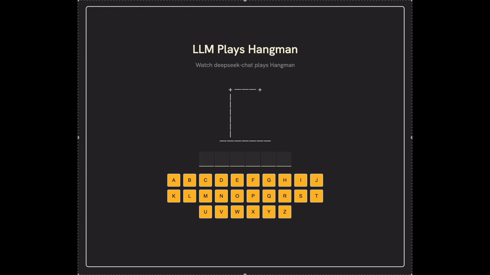

# LLM Plays Hangman

<div style="display: flex; justify-content: center;">
  
</div>

AI Hangman is a web-based game where a language model plays the classic game of Hangman. The game is built using React, providing a fast and interactive experience.

## Features

- **AI-Powered Gameplay**: The game utilizes OpenAI's language model to make guesses and provide reasoning for each guess.
- **Interactive UI**: Built with React, the game offers a dynamic and engaging user interface.
- **Language Chips**: Visual representation of programming languages, adding a unique twist to the game.
- **Responsive Design**: Ensures a seamless experience across different devices.

## Getting Started

### Prerequisites

- Node.js and npm installed on your machine.

### Installation

1. Clone the repository:

   ```bash
   git clone https://github.com/Isaac415/ai-hangman.git
   ```

2. Navigate to the project directory:

   ```bash
   cd ai-hangman
   ```

3. Install the dependencies:

   ```bash
   npm install
   ```

### Running the Game

To start the development server, run:

```bash
npm run dev
```
